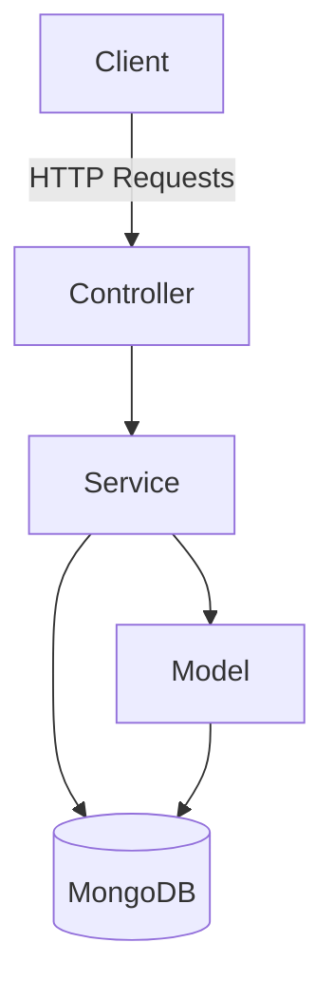
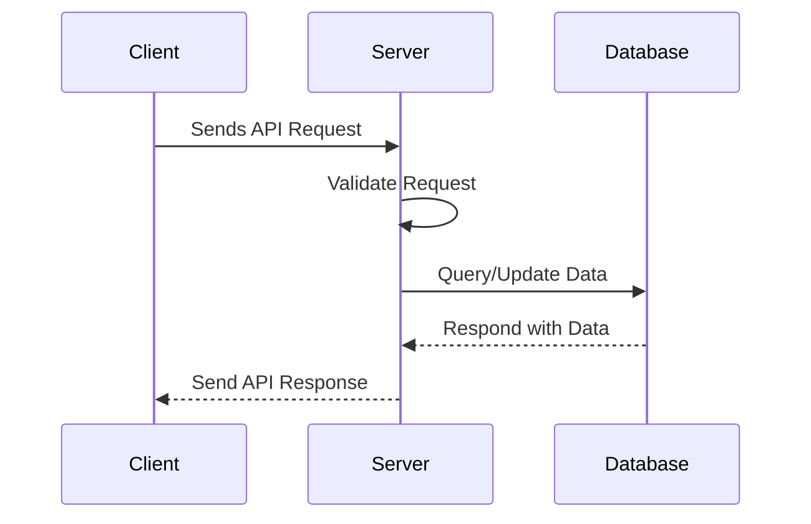

# Sample Node.js Application

This document provides an overview of a sample Node.js application, including its architecture and workflow. The document also includes mermaid diagrams for better visualization.

## Application Overview

The sample Node.js application is a RESTful API that allows users to manage a collection of items. It includes the following features:
- Create, read, update, and delete (CRUD) operations.
- Authentication and authorization.
- Integration with a MongoDB database.

## Architecture

The application follows a typical Model-View-Controller (MVC) architecture. Below is a mermaid diagram illustrating the architecture:



## Workflow

The following diagram shows the workflow of a typical API request:



## Getting Started

To run the application locally, follow these steps:

1. Clone the repository:
   ```bash
   git clone https://github.com/your-repo/sample-nodejs-app.git
   cd sample-nodejs-app
   ```

2. Install dependencies:
   ```bash
   npm install
   ```

3. Set up environment variables in a `.env` file:
   ```env
   PORT=3000
   MONGO_URI=mongodb://localhost:27017/sampledb
   JWT_SECRET=your_secret_key
   ```

4. Start the application:
   ```bash
   npm start
   ```

5. Access the application at [http://localhost:3000](http://localhost:3000).

## Reference Links

- [Node.js Documentation](https://nodejs.org/en/docs/)
- [Express.js Documentation](https://expressjs.com/)
- [MongoDB Documentation](https://www.mongodb.com/docs/)
- [Mermaid Documentation](https://mermaid-js.github.io/mermaid/)
